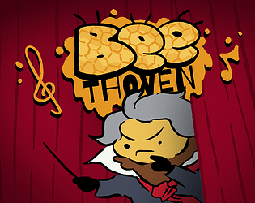


A Rhythm game I made for a week-long game-jam

 

## A new Challenge

This was my second time participating in a game-jam, and I had never made a rhythm game.

For this jam I teamed up with [François Dohant](https://www.artstation.com/francesco-dht), who made all the cute art and animations.
We first had the idea for the title of the game, we found the wordplay funny, and decided to make a game out of it.

## My part of the work
I did all the programming for this short game, I detailed here the parts I found most significant.

### The notes and track system
BEEthoven is similar to guitar hero in this regard, the game has four tracks that the notes slide along, the tracks end with a "Hitter", this reacts when the player hits keys.
Hitting a note is awards score based on how precisely it was hit.

As this was **my first rhythm game**, my approach was simple, albeit naive: 
Each note has a timer that starts counting down when it is instantiated, when the timer goes into the negatives past a certain grace period, the note is destroyed.

each note also carries data that defines a "hit window", when the timer value is in that window, the player can hit that note.
If the note is hit while its hit window is active, the note is destroyed and awards score.

### The scoring 
Making the `scoring system` was relatively easy once everything else was in place, a script listens for events that trigger when a note is scored, and awards score each time a note is hit.

The score a note awards is calculated based on how close its timer is to zero, I defined "time regions" so when hitting a note the precision is broken up into **good**, **very good**, and **perfect**, these correspond to increasingly narrow timing windows and award different point values.

### Using new tools
This was my first time really poking around in the `Unity animation system`, I used it to make all the menu transitions, the curtains opening, elements sliding out of view etc.
I also used it to fine-tune the characters animations and sync them with player actions, it seems trivial, but even a slight delay in the feedback can end up hurting game feel, especially for a rhythm game.

## Conclusion
This game was an interesting challenge for me, since I had never dealt with timing mechanics before, I had to learn as I went.
I also had some responsibility towards my teammate, I had to teach him how to use git to commit the art files to the project.