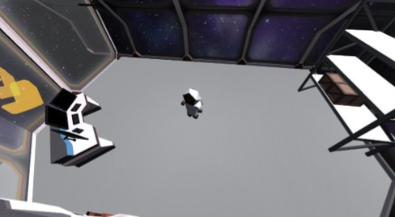
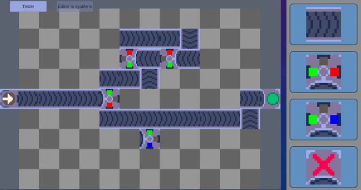


Build factories, link conveyors, profit.

  

## An attempt at a serious game

This game was made on `Unity` with a team of six, over the course of three months for a class on **serious games**.

We were given a theme: **demystify Artificial Intelligence**

This inspired us to make this puzzle game, in this fictional universe, geometry is a flourishing business, and to become the leader in this industry, the player must **setup supply lines** for their factory by placing conveyors and machines intelligently.

The 3D part of the game allow the player to walk around and select the stage they want to play by walking up to it, the main gameplay loop happens in the 2D sections, were the player can freely design their conveyor lines and using machines that paint, sort or reshape shapes.

## My part of the work
### The 2D grid
I developped the **grid system** as well as the scripts that allow machines and conveyors to be highlighted, placed, destroyed etc.
This game, although unplayable as of now, was a good exercise in **writing expandable code** that would allow for a future person to design theyr own grid objects, machines, and conveyors.

### The art
I also drew the sprites for the 2D sections of the game.