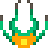
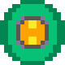


Somewhere in space, a spaceship fights hordes of foes with the power of friendship, but they don't all have to stay ennemies...

 

## A very personal project...

A Shoot'em up arcade game where you can **convert enemies into friends**.

Friend-Ship is my current passion project, as a huge fan of the shmup genre, 
I wanted to try my hand at making one.

I have been working on this game for about 2 years in between classes, from the [playable demo](https://adam-wizard.itch.io/friend-ship-demo) i made to the project it has become today, we are currently working on it as "whiteboard", a team of 3 students, as part of a class project at the `UQAC` (Université du Québec à Chicoutimi).

## And a challenge 

Friend-Ship also proved to be a good challenge in terms of **game design, programming, and art**, the current project is being developped using the `Unity` engine, and we are working especially hard to ensure that our code allows as much freedom as possible in order to design exotic bullet patterns, ennemis, bosses etc.

We are proud to challenge ourselves with relatively high bars to clear in terms of aesthetics, programming, and fun value, we aim to release the game on `steam` somewhere in the forseeable future.

## My part of the work

### The bullet pattern system
I was also responsible for setting up the `shooting system`, which is one of the very core parts of any shoot'em up game, the current version of our system allows for some freedom for creating patterns, as seen in the [trailer](https://youtu.be/O5IPaBvK3d0) we made.

This task was a great opportunity for me to challenge both my `math skills` and my `creativity` to come up with challenging and exotic looking patterns.

### The aesthetics
Working on this game has forced me to sharpen my skills, namely in the art department, **all sprites in the game** so far (including the ennemies you can see scattered around this page) were drawn and animated by me.

With the help of my team, **I conceptialized**, **sketched**, and **animated** a multitude of bullets, explosions and ennemies, they really bring flair to the game in a way i had never done before.

### Level design
Designing the levels of the game is an undertaking we are tackling **as a team**, testing and conceptualizing the encounters that the player will have to overcome.

In terms of enemy design, making the bosses stand out a lot from standard ennemies was a priority, to provide a **memorable boss-fighting experience**.

This project is still very much in its early stage, but so far it has proved to be both a fun project, and a learning opportunity, i am very proud and thankful of my team.

 
 
 

## 
To conclude, here is the short trailer we made.


