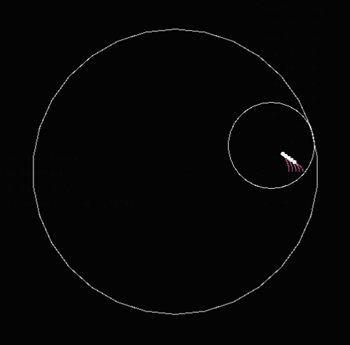
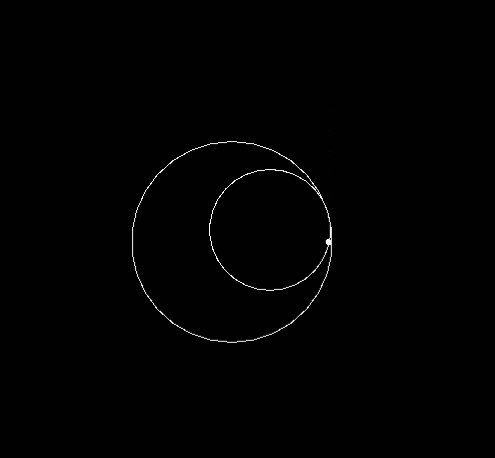


There is beauty in math, and we would prove it with this.

 

## My first "game"

As a team of two students, and over the course of six months, our goal was to make a program capable of visualizing spirographs using `C++` and `SFML`

This program has some interactive features, although the actual building of the spirograph (the size and amount of discs) has to be done beforehand.

With this application, a user can setup their spirograph and watch it draw itself.
all necessary information to use the program is detailed in the **README.md** file on the [github repository](https://github.com/AdamWizard/Projet_Spirograph).



It was my first experience with any kind of visual output software, we used `SFML` to render the shapes on a black background.

## My part of the work

### The math
I was in charge of defining and applying the **equations** that rule over the circular movement of the assembly, I deepened my mathematical skills, especially in the trigonometry department.

Since we had no prior information about the math of spirographs, a big part of this project was the **research** to figure out a model that would both be mathematicaly correct, and produce aestheticaly pleasing shapes.

### The class architecture
In addition to the basic math principles that govern the spirographs movement, I also **conceptualized and developped** the main classes that represent the spirograph itself, this has improved my understanding of `C++` and object oriented code in general.

## Conclusion
This project was a step up for me in terms of involvement, planning and teamwork.
I am proud of the result, and I think that we achieved the goal we initially set.