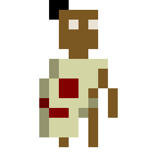
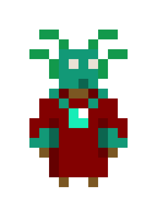

2D Puzzle game with a timeloop mechanic

## My first experience using a game engine

This was a class project made over the course of six months with four teamates assisting me, we had game-jam-like constraints in the sense that we had a theme to stick with: **time manipulation**.

This inspired us to come up with [this puzzle game](https://adam-wizard.itch.io/a-sacrifice-for-the-turquoise-lord).

It was a first for me using **Unity** (or any kind of mainstream game engine), and coding in **C#**. It was also my first time using **Perforce** as a version control tool.

The result is althoug a bit unpolished, entirely playable.

### My part of the work
Working on this project, I came to experience with drawing basic sprites and tiles.

I was also responsible for developping the equipment system (the dagger, bow and shield that the player can use) and make it as flexible as possible to allow more tools to be added.

Finaly, I acquired some level design experience by designing the puzzles of each room with my team.

