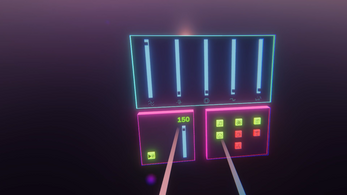


Grab the decks in VR!

 

## A live audio experience in VR

This VR game allows the player to **mix music tracks** live using a simplified control panel.

VRDJ can be downloaded and played from [this itch.io page](https://pierreraphaelwozny.itch.io/djvr)

The playing scene features a nightchlub-like aesthetic with copious amounts of lasers that move in rythm and sync to the bpm of the music.

This game was made with a team of three over the course of six months.

We wanted to make a game that teaches the basics of mixing music and makes it somewhat **accessible**, as most of the hardware and software used by professional DJs are expensive and require prior knowledge.

### My part of the work
This project was **a complete gear shift** for me, as i mainly participated in the **visual design of the scene**, my job was less coding-oriented than usual.

In terms of assets, i was in charge of developping the scripts that govern the movement of the lasers, aswell as comming up with a solution to make them **sync to the beat in real time**.

